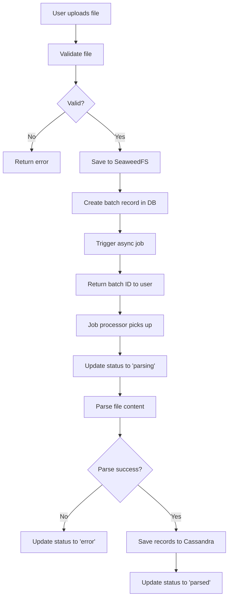

# Batch Upload Feature Implementation Plan

## Overview
Implementation plan for the batch-upload feature that allows users to upload multiple card template files at once, with proper storage in SeaweedFS and tracking in the database.

## Feature Scope

### In Scope
1. **Drag-and-drop file upload component** (reusable)
2. **File validation** (type, size)
3. **SeaweedFS storage** with user email-based paths
4. **Database schema** for batch tracking
5. **Async job triggering** for batch parsing
6. **Status tracking** (uploaded, parsing, parsed, loaded, error)
7. **Error handling** and user feedback

### Out of Scope
- Actual parsing logic (handled by future batch-parse feature)
- View Batches UI (separate feature)
- Template Designer integration (handled by template-textile feature)

## Architecture Components

### 1. Database Schema

#### PostgreSQL - Batch Tracking Table
```sql
CREATE TABLE batches (
    id UUID PRIMARY KEY DEFAULT gen_random_uuid(),
    user_email VARCHAR(255) NOT NULL,
    file_name VARCHAR(255) NOT NULL,
    file_size INTEGER NOT NULL,
    file_path TEXT NOT NULL,
    status VARCHAR(20) NOT NULL DEFAULT 'uploaded',
    created_at TIMESTAMP DEFAULT CURRENT_TIMESTAMP,
    updated_at TIMESTAMP DEFAULT CURRENT_TIMESTAMP,
    error_message TEXT,
    processed_at TIMESTAMP,
    CHECK (status IN ('uploaded', 'parsing', 'parsed', 'loaded', 'error'))
);

CREATE INDEX idx_batches_user_email ON batches(user_email);
CREATE INDEX idx_batches_status ON batches(status);
```

#### Cassandra - Batch Records Table (for future use)
```cql
CREATE TABLE IF NOT EXISTS batch_records (
    batch_id UUID,
    record_id UUID,
    full_name TEXT,
    given_name TEXT,
    family_name TEXT,
    middle_name TEXT,
    prefix TEXT,
    suffix TEXT,
    email TEXT,
    phone TEXT,
    organization TEXT,
    title TEXT,
    department TEXT,
    notes TEXT,
    created_at TIMESTAMP,
    PRIMARY KEY (batch_id, record_id)
);
```

### 2. API Endpoints

#### Upload Endpoint
```
POST /api/batches/upload
Headers:
  - Authorization: Bearer {token}
  - Content-Type: multipart/form-data
Body:
  - file: File (max 10MB)
Response:
  {
    "id": "uuid",
    "status": "uploaded",
    "message": "File uploaded successfully"
  }
```

#### Status Endpoint
```
GET /api/batches/{id}/status
Response:
  {
    "id": "uuid",
    "status": "parsing|parsed|loaded|error",
    "progress": 45,
    "error_message": null
  }
```

#### List User Batches
```
GET /api/batches
Query params:
  - status: filter by status
  - page: pagination
  - limit: results per page
Response:
  {
    "batches": [...],
    "total": 42,
    "page": 1
  }
```

### 3. Frontend Components

#### FileUploadComponent
- Location: `/front-cards/features/batch-upload/components/FileUploadComponent.tsx`
- Props:
  - `onSuccess: (batch: Batch) => void`
  - `onError: (error: Error) => void`
  - `acceptedFileTypes: string[]`
  - `maxFileSize: number`
- Features:
  - Drag-and-drop zone
  - Click to browse
  - Progress indicator
  - Error display

#### BatchStatusTracker
- Location: `/front-cards/features/batch-upload/components/BatchStatusTracker.tsx`
- Real-time status updates via WebSocket
- Progress bar
- Error details display

### 4. File Storage Structure

```
SeaweedFS Structure:
/buckets/files/batches/{user_email}/{filename}

Example:
/buckets/files/batches/invoketheoracle@gmail.com/contacts.vcf
/buckets/files/batches/john.doe@example.com/employees.csv
```

### 5. Async Processing Flow



## Implementation Steps

### Phase 1: Database Setup
1. Create Prisma migration for batches table
2. Create Cassandra keyspace and batch_records table
3. Add indexes for performance

### Phase 2: Backend API
1. Create `/api-server/src/features/batch-upload/` structure
2. Implement file upload endpoint with multer
3. Add SeaweedFS integration service
4. Create batch tracking repository
5. Implement status endpoint
6. Add job queue integration (BullMQ)

### Phase 3: Frontend Components
1. Create `/front-cards/features/batch-upload/` structure
2. Build reusable FileUploadComponent
3. Implement BatchStatusTracker
4. Add API service layer
5. Create upload page/modal

### Phase 4: Integration
1. Connect frontend to backend
2. Test file uploads end-to-end
3. Verify SeaweedFS storage
4. Test status tracking
5. Ensure proper error handling

### Phase 5: Placeholder for batch-import
1. Create basic endpoint structure
2. Add route definitions
3. Return mock responses
4. Document for future implementation

## Security Considerations

1. **Authentication**: Verify JWT token on all endpoints
2. **Authorization**: Users can only access their own batches
3. **File Validation**:
   - Max size: 10MB
   - Allowed types: .csv, .txt, .vcf, .xls, .xlsx
   - Filename sanitization
4. **Path Traversal Prevention**: Sanitize user email for directory names
5. **Rate Limiting**: Max 10 uploads per hour per user

## Error Handling

### Upload Errors
- File too large: "File exceeds 10MB limit"
- Invalid type: "Only CSV, TXT, VCF, XLS, and XLSX files are allowed"
- Storage failure: "Failed to save file. Please try again"
- Network error: "Connection lost. Please check your internet"

### Processing Errors
- Invalid format: "File format is invalid at line X"
- Missing fields: "Required field 'email' is missing"
- Parsing failure: "Unable to parse file content"

## Testing Strategy

### Unit Tests
- File validation logic
- SeaweedFS path generation
- Database operations
- Error handling

### Integration Tests
- File upload flow
- Status tracking
- WebSocket updates
- Error scenarios

### E2E Tests
- Complete upload workflow
- Multiple file types
- Large file handling
- Concurrent uploads

## Performance Considerations

1. **Chunked Upload**: For files > 5MB, use chunked upload
2. **Streaming**: Stream file to SeaweedFS without loading in memory
3. **Batch Processing**: Process records in batches of 100
4. **Indexing**: Proper database indexes for query performance
5. **Caching**: Cache batch status for 5 seconds

## Success Metrics

1. Upload success rate > 95%
2. Average upload time < 5 seconds for 10MB file
3. Processing time < 30 seconds for 1000 records
4. Error rate < 2%
5. User satisfaction score > 4/5

## Dependencies

### External Services
- SeaweedFS for file storage
- Redis for job queue
- PostgreSQL for metadata
- Cassandra for parsed records

### Libraries
- multer (file upload)
- aws-sdk (S3 compatible for SeaweedFS)
- bullmq (job queue)
- uuid (ID generation)
- zod (validation)

## Timeline Estimate

- Phase 1 (Database): 2 hours
- Phase 2 (Backend API): 4 hours
- Phase 3 (Frontend): 4 hours
- Phase 4 (Integration): 2 hours
- Phase 5 (Placeholder): 1 hour
- Testing: 3 hours

**Total: ~16 hours**

## Future Enhancements

1. Batch file preview before upload
2. Resume interrupted uploads
3. Bulk actions (delete, retry multiple batches)
4. Export batch history
5. Email notifications on completion
6. Support for more file formats (JSON, XML)