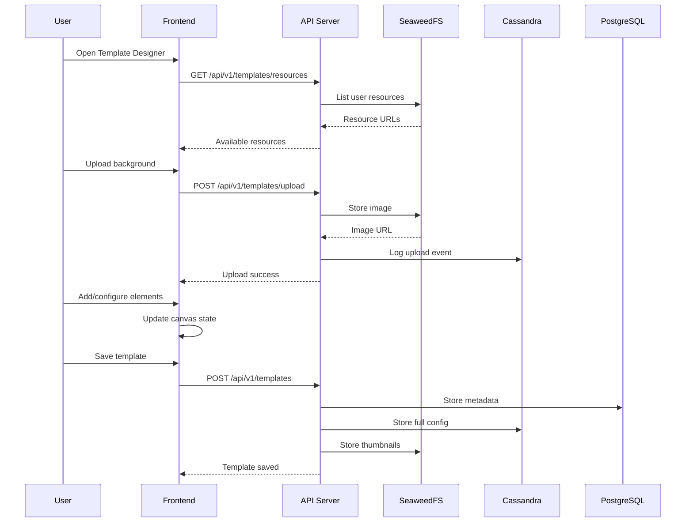

# Template Designer Feature - Architecture Plan

## Executive Summary

The Template Designer feature provides a comprehensive visual editor for creating custom e-card/vCard templates with drag-and-drop functionality, real-time preview, and seamless integration with SeaweedFS for asset storage and Cassandra for template configuration persistence.

**Feature Name:** `template-designer`
**Priority:** HIGH
**Estimated Timeline:** 3-4 weeks
**Dependencies:** s3-bucket (SeaweedFS integration), simple-projects

---

## Table of Contents

1. [Feature Overview](#feature-overview)
2. [Architecture Design](#architecture-design)
3. [Component Structure](#component-structure)
4. [Data Models](#data-models)
5. [Integration Points](#integration-points)
6. [Implementation Phases](#implementation-phases)
7. [Technical Decisions](#technical-decisions)
8. [Risk Assessment](#risk-assessment)
9. [Testing Strategy](#testing-strategy)
10. [Performance Targets](#performance-targets)

---

## Feature Overview

### Purpose
Enable users to design professional e-card templates through a visual interface that supports text, image, and QR code elements with precise positioning, styling, and dynamic behavior rules.

### Core Capabilities
- **Visual Canvas Editor**: Drag-and-drop interface for element placement
- **Resource Management**: Upload/manage fonts, icons, and images
- **Text Configuration**: Advanced text styling with per-word rules
- **Table Containers**: Auto-adjusting layouts for contact information
- **Real-time Preview**: Live preview with sample data
- **Template Persistence**: Save/load templates with full configuration

### User Journey
1. User clicks "Template Designer" (renamed from "Template Designer") in Quick Actions
2. System loads template designer interface with canvas
3. User uploads background image or selects from library
4. User adds/configures text, image, and QR elements
5. User tests template with sample data
6. User saves template for batch processing

---

## Architecture Design

### High-Level Architecture

```
┌─────────────────────────────────────────────────────────────────┐
│                         Frontend (Next.js)                       │
├─────────────────────────────────────────────────────────────────┤
│                    /features/template-designer                   │
│  ┌──────────────┬──────────────┬──────────────┬──────────────┐ │
│  │   Canvas     │   Element    │   Resource   │   Template   │ │
│  │  Component   │   Toolbox    │   Manager    │    Config    │ │
│  │              │              │              │              │ │
│  │  - Fabric.js │  - Text Tool │  - Upload    │  - Save/Load │ │
│  │  - Drag/Drop │  - Image Tool│  - Library   │  - Settings  │ │
│  │  - Zoom/Pan  │  - QR Tool   │  - Delete    │  - Export    │ │
│  └──────────────┴──────────────┴──────────────┴──────────────┘ │
│                              ↓                                   │
│                    Template Service (API Client)                 │
└─────────────────────────────────┬───────────────────────────────┘
                                  │ HTTP/REST
┌─────────────────────────────────┴───────────────────────────────┐
│                      API Server (Fastify)                        │
├─────────────────────────────────────────────────────────────────┤
│                   /src/features/template-designer                │
│  ┌──────────────┬──────────────┬──────────────┬──────────────┐ │
│  │  Controller  │   Service    │  Repository  │  Validators  │ │
│  │              │              │              │              │ │
│  │  - CRUD      │  - Business  │  - Cassandra │  - Zod       │ │
│  │  - Upload    │    Logic     │  - PostgreSQL│  - File      │ │
│  │  - Preview   │  - Transform │  - S3 Client │  - Template  │ │
│  └──────────────┴──────────────┴──────────────┴──────────────┘ │
│                              ↓                                   │
│                    Integration Services                          │
│  ┌──────────────────────┬────────────────────────────────────┐ │
│  │    S3-Bucket         │         Database Layer              │ │
│  │   (SeaweedFS)        │    (Cassandra + PostgreSQL)         │ │
│  └──────────────────────┴────────────────────────────────────┘ │
└─────────────────────────────────────────────────────────────────┘
```

### Data Flow



---

## Component Structure

### Frontend Components (`/front-cards/features/template-designer/`)

```
template-designer/
├── components/
│   ├── TemplateDesigner.tsx          # Main container component
│   ├── Canvas/
│   │   ├── DesignCanvas.tsx         # Fabric.js canvas wrapper
│   │   ├── CanvasControls.tsx       # Zoom, pan, grid controls
│   │   ├── ElementHandles.tsx       # Resize/rotate handles
│   │   └── SelectionTools.tsx       # Multi-select, align tools
│   ├── Toolbox/
│   │   ├── ElementToolbox.tsx       # Element selection panel
│   │   ├── TextTool.tsx             # Text element creator
│   │   ├── ImageTool.tsx            # Image element creator
│   │   ├── QRTool.tsx               # QR code creator
│   │   └── TableTool.tsx            # Table container creator
│   ├── PropertyPanel/
│   │   ├── PropertyPanel.tsx        # Main properties container
│   │   ├── TextProperties.tsx       # Text-specific props
│   │   ├── ImageProperties.tsx      # Image-specific props
│   │   ├── QRProperties.tsx         # QR-specific props
│   │   └── StyleRules.tsx           # Per-word styling config
│   ├── ResourceManager/
│   │   ├── ResourceLibrary.tsx      # Resource browser
│   │   ├── ResourceUploader.tsx     # Upload interface
│   │   ├── FontManager.tsx          # Font management
│   │   └── AssetGrid.tsx            # Grid view of assets
│   ├── Preview/
│   │   ├── PreviewPanel.tsx         # Live preview container
│   │   ├── TestDataForm.tsx         # Sample data input
│   │   └── RenderPreview.tsx        # Rendered output display
│   └── Settings/
│       ├── TemplateSettings.tsx     # Global template config
│       ├── DimensionsConfig.tsx     # Canvas size settings
│       └── ExportSettings.tsx       # Output format options
├── hooks/
│   ├── useCanvas.ts                  # Canvas state management
│   ├── useElements.ts                # Element CRUD operations
│   ├── useResources.ts               # Resource management
│   ├── useTemplateStorage.ts         # Save/load templates
│   ├── useUndoRedo.ts                # History management
│   └── useKeyboardShortcuts.ts       # Keyboard shortcuts
├── services/
│   ├── templateService.ts            # API client for templates
│   ├── resourceService.ts            # Asset upload/management
│   └── previewService.ts             # Preview generation
├── stores/
│   ├── templateStore.ts              # Zustand store for template state
│   ├── canvasStore.ts                # Canvas state (zoom, selection)
│   └── resourceStore.ts              # Cached resources
├── types/
│   ├── index.ts                      # Main type exports
│   ├── elements.ts                   # Element type definitions
│   ├── canvas.ts                     # Canvas-specific types
│   └── resources.ts                  # Resource types
├── utils/
│   ├── fabricHelpers.ts              # Fabric.js utilities
│   ├── elementFactory.ts             # Create Fabric objects
│   ├── exportHelpers.ts              # Export utilities
│   └── validationHelpers.ts          # Client-side validation
└── styles/
    └── template-designer.css         # Component-specific styles
```

### Backend Components (`/api-server/src/features/template-designer/`)

```
template-designer/
├── controllers/
│   ├── templateController.ts         # Template CRUD handlers
│   ├── resourceController.ts         # Resource upload handlers
│   └── previewController.ts          # Preview generation
├── services/
│   ├── templateService.ts            # Business logic
│   ├── resourceService.ts            # Resource management
│   ├── validationService.ts          # Template validation
│   └── renderService.ts              # Preview rendering
├── repositories/
│   ├── templateRepository.ts         # PostgreSQL queries
│   ├── configRepository.ts           # Cassandra operations
│   └── resourceRepository.ts         # S3 operations
├── validators/
│   ├── templateValidators.ts         # Zod schemas
│   ├── elementValidators.ts          # Element validation
│   └── uploadValidators.ts           # File validation
├── routes/
│   └── templateRoutes.ts             # Route definitions
├── types/
│   └── index.ts                      # TypeScript types
└── utils/
    ├── canvasRenderer.ts              # Server-side rendering
    └── fontLoader.ts                  # Font management
```

---

## Data Models

### Template Model (PostgreSQL)

```typescript
interface Template {
  id: string;                    // UUID
  userId: string;                 // User who created it
  projectId: string;              // Associated project
  name: string;                   // Template name
  type: 'vcard' | 'qr-square' | 'qr-vertical';
  status: 'draft' | 'active' | 'archived';
  backgroundUrl?: string;         // SeaweedFS URL
  thumbnailUrl?: string;          // Preview thumbnail
  width: number;                  // Canvas width in pixels
  height: number;                 // Canvas height in pixels
  exportFormat: 'jpg' | 'png';
  exportDpi: number;              // Default: 300
  phonePrefix?: string;           // e.g., "2459-"
  extensionLength?: number;       // Default: 4
  websiteUrl?: string;            // Default company website
  brandColors: Record<string, string>;  // Named colors
  createdAt: Date;
  updatedAt: Date;
}
```

### Template Configuration (Cassandra)

```typescript
interface TemplateConfig {
  templateId: string;             // Partition key
  version: number;                // Clustering key
  userId: string;
  projectId: string;
  elements: TemplateElement[];    // Full element array
  globalSettings: {
    fonts: string[];              // Available fonts
    defaultFont: string;
    defaultColor: string;
    gridSize: number;
    snapToGrid: boolean;
  };
  metadata: {
    lastModifiedBy: string;
    lastModifiedAt: Date;
    elementCount: number;
    resourceCount: number;
  };
  timestamp: Date;                // Event timestamp
}
```

### Element Types

```typescript
type TemplateElement = TextElement | ImageElement | QRElement | TableElement;

interface BaseElement {
  id: string;
  type: 'text' | 'image' | 'qr' | 'table';
  name: string;                   // Display name
  x: number;                      // X position
  y: number;                      // Y position
  width?: number;
  height?: number;
  rotation?: number;              // Degrees
  opacity?: number;               // 0-1
  locked?: boolean;               // Prevent editing
  visible?: boolean;              // Show/hide
  zIndex?: number;                // Layer order
}

interface TextElement extends BaseElement {
  type: 'text';
  field: string;                  // Data field mapping
  content?: string;               // Static text
  fontFamily: string;
  fontSize: number;
  fontWeight?: number;
  fontStyle?: 'normal' | 'italic';
  color: string;
  textAlign?: 'left' | 'center' | 'right';
  lineHeight?: number;
  letterSpacing?: number;
  maxWidth?: number;              // Text container width
  maxLines?: number;              // Line limit
  autoFit?: {
    enabled: boolean;
    minSize: number;
    maxSize: number;
    singleLine?: boolean;
  };
  styleRules?: Array<{
    type: 'firstWord' | 'lastWord' | 'wordIndex' | 'pattern';
    value?: string | number;     // Pattern or index
    color?: string;
    fontWeight?: number;
    fontSize?: number;
  }>;
}

interface ImageElement extends BaseElement {
  type: 'image';
  assetUrl: string;               // SeaweedFS URL
  field?: string;                 // For dynamic images
  scaleMode?: 'fill' | 'fit' | 'stretch';
  visibilityField?: string;       // Dynamic visibility
  dynamicPosition?: {
    xField?: string;
    yField?: string;
    formula?: string;             // e.g., "max(text1.right, text2.right) + 10"
  };
}

interface QRElement extends BaseElement {
  type: 'qr';
  field: string;                  // Data to encode
  qrType: 'url' | 'text' | 'vcard' | 'email' | 'phone';
  size: number;                   // QR code size
  margin: number;                 // Quiet zone
  colorDark: string;
  colorLight: string;
  errorCorrection: 'L' | 'M' | 'Q' | 'H';
  logo?: {
    url: string;
    size: number;                 // Percentage of QR size
  };
}

interface TableElement extends BaseElement {
  type: 'table';
  rows: number;
  columns: number;
  cellWidth: number;
  cellHeight: number;
  borderWidth?: number;
  borderColor?: string;
  backgroundColor?: string;
  autoCollapse?: boolean;         // Remove empty rows
  cells: Array<{
    row: number;
    column: number;
    element?: TemplateElement;    // Nested element
    padding?: number;
    backgroundColor?: string;
  }>;
}
```

### Resource Model

```typescript
interface TemplateResource {
  id: string;
  userId: string;
  projectId: string;
  type: 'font' | 'icon' | 'image' | 'background';
  name: string;
  url: string;                    // SeaweedFS URL
  thumbnailUrl?: string;
  mimeType: string;
  size: number;                    // Bytes
  metadata: {
    width?: number;                // For images
    height?: number;
    fontFamily?: string;           // For fonts
    tags?: string[];
  };
  createdAt: Date;
}
```

---

## Integration Points

### 1. SeaweedFS (S3-Bucket Feature)

```typescript
// Resource upload
await s3Service.putObject(
  'templates',
  `${userId}/${projectId}/resources/${resourceId}`,
  buffer,
  { contentType, metadata }
);

// Template background storage
await s3Service.putObject(
  'templates',
  `${userId}/${projectId}/backgrounds/${templateId}`,
  backgroundBuffer
);

// Thumbnail generation
await s3Service.putObject(
  'templates',
  `${userId}/${projectId}/thumbnails/${templateId}`,
  thumbnailBuffer
);
```

### 2. Cassandra Integration

```typescript
// Store template configuration
await cassandraClient.execute(
  `INSERT INTO template_configs (template_id, version, user_id, project_id, elements, global_settings, metadata, timestamp)
   VALUES (?, ?, ?, ?, ?, ?, ?, ?)`,
  [templateId, version, userId, projectId, JSON.stringify(elements), JSON.stringify(globalSettings), JSON.stringify(metadata), new Date()]
);

// Retrieve latest configuration
const result = await cassandraClient.execute(
  `SELECT * FROM template_configs WHERE template_id = ? ORDER BY version DESC LIMIT 1`,
  [templateId]
);
```

### 3. Quick Actions Integration

```typescript
// Update QuickActions component
<QuickActions
  onCreateTemplate={() => router.push('/template-designer')}
  onImportBatch={() => router.push('/batch-import')}
  onViewBatches={() => router.push('/batches')}
/>

// Update button text
<p className={getTitleClasses()}>Template Designer</p>
<p className={getDescriptionClasses()}>Design custom card templates</p>
```

### 4. Render Worker Integration

The template configuration will be used by the render-worker to generate cards:

```typescript
// render-worker/src/features/card-renderer/
interface RenderJob {
  templateId: string;
  templateConfig: TemplateConfig;
  staffData: CanonicalStaff;
  outputFormat: 'jpg' | 'png';
  outputDpi: number;
}
```

---

## Implementation Phases

### Phase 1: Foundation (Week 1)
- [ ] Create feature structure in front-cards and api-server
- [ ] Set up database schemas (PostgreSQL + Cassandra)
- [ ] Implement basic template CRUD operations
- [ ] Create Canvas component with Fabric.js
- [ ] Basic drag-and-drop functionality

### Phase 2: Element System (Week 1-2)
- [ ] Implement text element with properties panel
- [ ] Implement image element with upload
- [ ] Implement QR code element
- [ ] Add element selection and manipulation
- [ ] Create property panels for each element type

### Phase 3: Resource Management (Week 2)
- [ ] Resource upload to SeaweedFS
- [ ] Resource library UI
- [ ] Font management system
- [ ] Asset categorization and search
- [ ] Thumbnail generation

### Phase 4: Advanced Features (Week 2-3)
- [ ] Table containers with auto-adjustment
- [ ] Per-word styling rules
- [ ] Dynamic positioning formulas
- [ ] Auto-fit text algorithm
- [ ] Undo/redo system

### Phase 5: Preview & Testing (Week 3)
- [ ] Real-time preview panel
- [ ] Test data input form
- [ ] Server-side rendering for preview
- [ ] Template validation
- [ ] Export to different formats

### Phase 6: Polish & Integration (Week 3-4)
- [ ] Keyboard shortcuts
- [ ] Copy/paste elements
- [ ] Template duplication
- [ ] Performance optimization
- [ ] Error handling and recovery

---

## Technical Decisions

### Canvas Library: Fabric.js
**Rationale:**
- Mature library with extensive documentation
- Built-in object model perfect for our element system
- Excellent serialization/deserialization
- Strong community support
- Native support for text, images, and shapes

### State Management: Zustand + React Context
**Rationale:**
- Lightweight compared to Redux
- TypeScript-first design
- Easy integration with React hooks
- Separate stores for different concerns
- Good DevTools support

### Storage Strategy
- **PostgreSQL**: Template metadata, quick queries, relationships
- **Cassandra**: Full configuration with versioning, event log
- **SeaweedFS**: All binary assets (images, fonts, exports)
- **Redis**: Temporary preview cache, session data

### Rendering Strategy
- **Client-side**: Interactive editing with Fabric.js
- **Server-side**: Final rendering with node-canvas for consistency
- **Preview**: Hybrid approach using cached server renders

---

## Risk Assessment

### Technical Risks

1. **Canvas Performance**
   - Risk: Lag with many elements
   - Mitigation: Virtualization, layer optimization, element limits

2. **Font Handling**
   - Risk: Custom fonts not rendering correctly
   - Mitigation: Server-side font validation, fallback system

3. **Large File Uploads**
   - Risk: Timeout or memory issues
   - Mitigation: Chunked uploads, progress tracking, size limits

### Business Risks

1. **Feature Complexity**
   - Risk: UI too complex for users
   - Mitigation: Progressive disclosure, templates library, tutorials

2. **Browser Compatibility**
   - Risk: Canvas features not working in all browsers
   - Mitigation: Feature detection, polyfills, graceful degradation

---

## Testing Strategy

### Unit Tests
```typescript
// Element creation
describe('ElementFactory', () => {
  it('should create text element with default properties');
  it('should validate element position bounds');
  it('should apply style rules correctly');
});

// Template validation
describe('TemplateValidator', () => {
  it('should reject invalid dimensions');
  it('should validate element overlaps');
  it('should check required fields');
});
```

### Integration Tests
```typescript
// API endpoints
describe('Template API', () => {
  it('POST /templates should Template Designer');
  it('PUT /templates/:id should update elements');
  it('GET /templates/:id/preview should generate preview');
});

// SeaweedFS integration
describe('Resource Upload', () => {
  it('should upload image to correct path');
  it('should generate thumbnail');
  it('should handle upload failures');
});
```

### E2E Tests
```typescript
// Full workflow
describe('Template Designer E2E', () => {
  it('should Template Designer from scratch');
  it('should load and edit existing template');
  it('should export template in multiple formats');
});
```

---

## Performance Targets

### Response Times
- Canvas interaction: < 16ms (60 FPS)
- Element selection: < 50ms
- Property update: < 100ms
- Preview generation: < 2s
- Template save: < 1s
- Resource upload: < 3s for 10MB file

### Resource Limits
- Max elements per template: 100
- Max template size: 50MB (including resources)
- Max background image: 20MB
- Max custom fonts: 10 per template
- Max undo history: 50 actions

### Scalability
- Support 100 concurrent designers
- Handle 1000 templates per user
- Store 10GB resources per user (based on tier)

---

## Security Considerations

### Access Control
- Templates scoped to user and project
- Resource sharing within project only
- Read-only access for shared templates

### Input Validation
- Sanitize all text inputs
- Validate file types and sizes
- Check for malicious scripts in SVGs
- Validate color codes and dimensions

### Data Protection
- Encrypt sensitive template data
- Audit trail for all modifications
- Soft delete with recovery period
- Regular backups to prevent data loss

---

## Monitoring & Analytics

### Key Metrics
- Template creation rate
- Average elements per template
- Most used element types
- Resource upload success rate
- Preview generation time
- User session duration

### Error Tracking
- Canvas rendering errors
- Upload failures
- API errors
- Browser compatibility issues

### User Analytics
- Feature usage patterns
- Common workflows
- Abandoned sessions
- Performance bottlenecks

---

## Future Enhancements

### Version 2.0
- Collaborative editing (real-time)
- Template marketplace
- AI-powered design suggestions
- Animation support
- Advanced blend modes

### Version 3.0
- Mobile app for template editing
- Video card templates
- 3D elements
- Custom JavaScript behaviors
- API for third-party integrations

---

## Success Criteria

1. **Functional**: All user stories implemented and working
2. **Performance**: Meets all performance targets
3. **Usability**: Users can create templates without training
4. **Reliability**: 99.9% uptime for template operations
5. **Scalability**: Handles projected user growth for 2 years

---

## Conclusion

The Template Designer feature represents a critical component of the E-Cards application, providing users with powerful design capabilities while maintaining system performance and reliability. This plan provides a comprehensive roadmap for implementation, with clear phases, technical decisions, and success metrics.

The modular architecture ensures maintainability and allows for future enhancements without major refactoring. Integration with existing features (s3-bucket, simple-projects) leverages proven patterns and reduces development risk.

---

**Document Version:** 1.0.0
**Last Updated:** 2025-01-18
**Author:** Feature Implementation Specialist
**Status:** Ready for Implementation