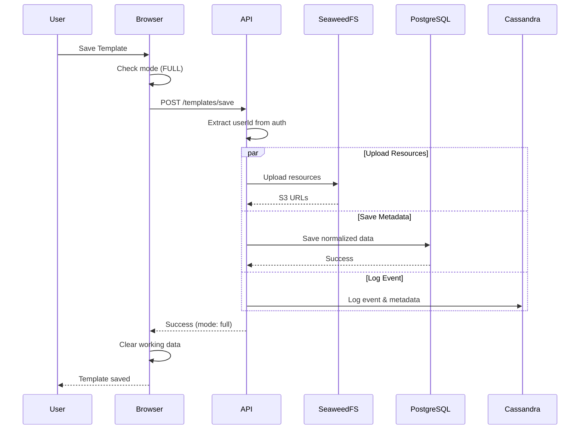
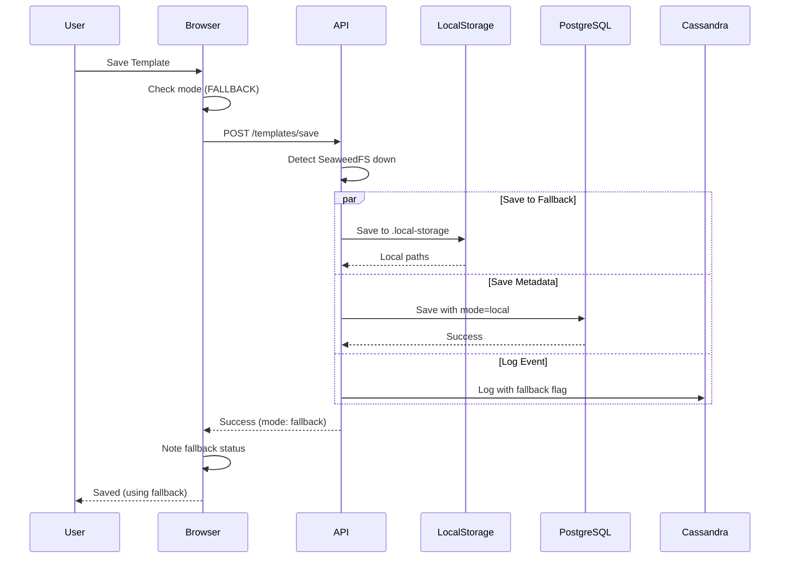
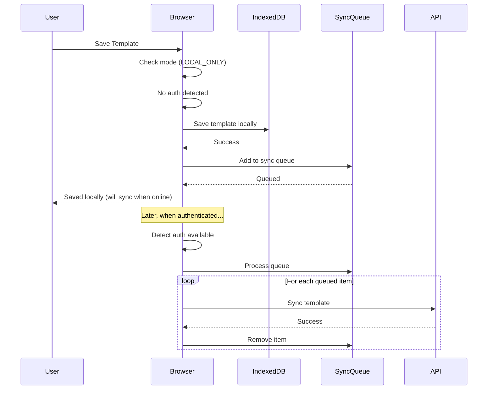

# Template Storage Technical Specifications

**Project**: E-Cards Template-Textile Feature
**Version**: 2.0 - Multi-Mode Architecture
**Date**: 2025-01-20

## Table of Contents

1. [Multi-Mode System Architecture](#multi-mode-system-architecture)
2. [Mode Detection Logic](#mode-detection-logic)
3. [Database Schema with Mode Support](#database-schema-with-mode-support)
4. [API Specifications with Mode Awareness](#api-specifications-with-mode-awareness)
5. [Browser Storage Schema Enhanced](#browser-storage-schema-enhanced)
6. [Storage Layer Strategy](#storage-layer-strategy)
7. [Data Flow by Mode](#data-flow-by-mode)
8. [Fallback Cascades](#fallback-cascades)
9. [Security & Authentication](#security--authentication)
10. [Performance Requirements by Mode](#performance-requirements-by-mode)

## Multi-Mode System Architecture

### Three Operational Modes

```
┌────────────────────────────────────────────────────────────────┐
│                     MODE DETECTION LAYER                       │
├────────────────────────────────────────────────────────────────┤
│  Authentication Check → SeaweedFS Health → Mode Selection      │
│                                                                │
│  ┌──────────────┐  ┌──────────────┐  ┌──────────────┐        │
│  │  FULL MODE   │  │ FALLBACK MODE│  │ LOCAL-ONLY   │        │
│  │  Auth: ✓     │  │  Auth: ✓     │  │  Auth: ✗     │        │
│  │  S3: ✓       │  │  S3: ✗       │  │  S3: N/A     │        │
│  └──────────────┘  └──────────────┘  └──────────────┘        │
└────────────────────────────────────────────────────────────────┘

FULL MODE Architecture:
┌──────────────────────────────────────────────────────────────────┐
│                         Browser Client                            │
│  IndexedDB (cache) → API Calls → WebSocket Updates               │
└──────────────────────────────────────────────────────────────────┘
                              ▼
┌──────────────────────────────────────────────────────────────────┐
│                         API Server                                │
│  Auth Middleware → Business Logic → Storage Router               │
└──────────────────────────────────────────────────────────────────┘
                              ▼
        ┌─────────────────┬─────────────────┬─────────────────┐
        ▼                 ▼                 ▼                 ▼
┌──────────────┐  ┌──────────────┐  ┌──────────────┐  ┌──────────────┐
│  SeaweedFS   │  │  PostgreSQL  │  │   Cassandra  │  │    Redis     │
│  (Primary)   │  │ (Normalized) │  │  (Events)    │  │   (Queue)    │
└──────────────┘  └──────────────┘  └──────────────┘  └──────────────┘

FALLBACK MODE Architecture:
┌──────────────────────────────────────────────────────────────────┐
│                         Browser Client                            │
│  IndexedDB (cache) → API Calls → WebSocket Updates               │
└──────────────────────────────────────────────────────────────────┘
                              ▼
┌──────────────────────────────────────────────────────────────────┐
│                         API Server                                │
│  Auth Middleware → Business Logic → Fallback Router              │
└──────────────────────────────────────────────────────────────────┘
                              ▼
        ┌─────────────────┬─────────────────┬─────────────────┐
        ▼                 ▼                 ▼                 ▼
┌──────────────┐  ┌──────────────┐  ┌──────────────┐  ┌──────────────┐
│.local-storage│  │  PostgreSQL  │  │   Cassandra  │  │    Redis     │
│  (Fallback)  │  │ (Normalized) │  │  (Events)    │  │   (Queue)    │
└──────────────┘  └──────────────┘  └──────────────┘  └──────────────┘

LOCAL-ONLY MODE Architecture:
┌──────────────────────────────────────────────────────────────────┐
│                         Browser Client                            │
│  IndexedDB (primary) → localStorage (settings) → Sync Queue      │
│  No server communication - Full offline operation                │
└──────────────────────────────────────────────────────────────────┘
```

## Mode Detection Logic

### Client-Side Detection

```typescript
// front-cards/features/template-textile/services/modeDetectionService.ts

enum StorageMode {
  FULL = 'full',
  FALLBACK = 'fallback',
  LOCAL_ONLY = 'local_only'
}

interface ModeDetectionResult {
  mode: StorageMode
  authenticated: boolean
  seaweedfsAvailable: boolean
  fallbackAvailable: boolean
  userId?: string
  username?: string
}

class ModeDetectionService {
  private checkInterval = 30000 // 30 seconds
  private currentMode: StorageMode = StorageMode.LOCAL_ONLY

  async detectMode(): Promise<ModeDetectionResult> {
    // Step 1: Check authentication
    const authCheck = await this.checkAuthentication()

    if (!authCheck.authenticated) {
      return {
        mode: StorageMode.LOCAL_ONLY,
        authenticated: false,
        seaweedfsAvailable: false,
        fallbackAvailable: false
      }
    }

    // Step 2: Check SeaweedFS availability
    const seaweedfsCheck = await this.checkSeaweedFS()

    if (seaweedfsCheck.available) {
      return {
        mode: StorageMode.FULL,
        authenticated: true,
        seaweedfsAvailable: true,
        fallbackAvailable: true, // Always available as backup
        userId: authCheck.userId,
        username: authCheck.username
      }
    }

    // Step 3: Check fallback availability
    const fallbackCheck = await this.checkFallbackStorage()

    if (fallbackCheck.available) {
      return {
        mode: StorageMode.FALLBACK,
        authenticated: true,
        seaweedfsAvailable: false,
        fallbackAvailable: true,
        userId: authCheck.userId,
        username: authCheck.username
      }
    }

    // If authenticated but no storage available, still use LOCAL_ONLY
    return {
      mode: StorageMode.LOCAL_ONLY,
      authenticated: true,
      seaweedfsAvailable: false,
      fallbackAvailable: false,
      userId: authCheck.userId,
      username: authCheck.username
    }
  }

  private async checkAuthentication(): Promise<AuthCheckResult> {
    try {
      const response = await fetch('/api/auth/user', {
        credentials: 'include'
      })

      if (response.ok) {
        const user = await response.json()
        return {
          authenticated: true,
          userId: user.id,
          username: user.username
        }
      }
    } catch (error) {
      console.warn('Auth check failed:', error)
    }

    return { authenticated: false }
  }

  private async checkSeaweedFS(): Promise<{ available: boolean }> {
    try {
      const response = await fetch('/api/storage/health/seaweedfs', {
        credentials: 'include',
        signal: AbortSignal.timeout(5000) // 5 second timeout
      })

      const data = await response.json()
      return { available: data.status === 'healthy' }
    } catch {
      return { available: false }
    }
  }

  private async checkFallbackStorage(): Promise<{ available: boolean }> {
    try {
      const response = await fetch('/api/storage/health/fallback', {
        credentials: 'include',
        signal: AbortSignal.timeout(3000) // 3 second timeout
      })

      const data = await response.json()
      return { available: data.status === 'available' }
    } catch {
      return { available: false }
    }
  }

  startModeMonitoring(callback: (mode: StorageMode) => void) {
    setInterval(async () => {
      const result = await this.detectMode()
      if (result.mode !== this.currentMode) {
        this.currentMode = result.mode
        callback(result.mode)
      }
    }, this.checkInterval)
  }
}
```

### Server-Side Detection

```typescript
// api-server/src/features/template-textile/services/serverModeDetection.ts

class ServerModeDetection {
  private seaweedfsHealthy = true
  private fallbackHealthy = true

  async getCurrentMode(): Promise<StorageMode> {
    // Check SeaweedFS
    if (await this.isSeaweedFSHealthy()) {
      return StorageMode.FULL
    }

    // Check fallback
    if (await this.isFallbackHealthy()) {
      return StorageMode.FALLBACK
    }

    // No storage available - should not happen in production
    throw new Error('No storage backend available')
  }

  private async isSeaweedFSHealthy(): Promise<boolean> {
    try {
      const response = await fetch(`${process.env.SEAWEEDFS_ENDPOINT}/status`)
      return response.ok
    } catch {
      return false
    }
  }

  private async isFallbackHealthy(): Promise<boolean> {
    try {
      await fs.access('.local-storage', fs.constants.W_OK)
      return true
    } catch {
      return false
    }
  }
}
```

## Database Schema with Mode Support

### PostgreSQL Tables (Enhanced)

#### templates
```sql
CREATE TABLE templates (
    id UUID PRIMARY KEY DEFAULT gen_random_uuid(),
    user_id UUID NOT NULL REFERENCES users(id) ON DELETE CASCADE,
    project_id UUID NOT NULL REFERENCES projects(id) ON DELETE CASCADE,
    name VARCHAR(255) NOT NULL,
    width INTEGER NOT NULL,
    height INTEGER NOT NULL,
    export_width INTEGER NOT NULL,
    element_count INTEGER DEFAULT 0,
    storage_url VARCHAR(500) NOT NULL,
    storage_mode VARCHAR(20) NOT NULL CHECK (storage_mode IN ('seaweedfs', 'local', 'browser')),
    thumbnail_url VARCHAR(500),
    is_public BOOLEAN DEFAULT FALSE,
    sync_status VARCHAR(20) DEFAULT 'synced' CHECK (sync_status IN ('synced', 'pending', 'failed')),
    created_at TIMESTAMP DEFAULT CURRENT_TIMESTAMP,
    updated_at TIMESTAMP DEFAULT CURRENT_TIMESTAMP,
    UNIQUE(user_id, project_id, name),
    INDEX idx_templates_user_id (user_id),
    INDEX idx_templates_project_id (project_id),
    INDEX idx_templates_storage_mode (storage_mode),
    INDEX idx_templates_sync_status (sync_status)
);
```

#### template_resources
```sql
CREATE TABLE template_resources (
    id UUID PRIMARY KEY DEFAULT gen_random_uuid(),
    template_id UUID NOT NULL REFERENCES templates(id) ON DELETE CASCADE,
    name VARCHAR(255) NOT NULL,
    type VARCHAR(50) NOT NULL CHECK (type IN ('IMAGE', 'FONT', 'SVG', 'VIDEO', 'AUDIO')),
    storage_url VARCHAR(500) NOT NULL,
    storage_mode VARCHAR(20) NOT NULL CHECK (storage_mode IN ('seaweedfs', 'local', 'browser')),
    hash VARCHAR(64) NOT NULL,
    size INTEGER NOT NULL,
    mime_type VARCHAR(100) NOT NULL,
    created_at TIMESTAMP DEFAULT CURRENT_TIMESTAMP,
    INDEX idx_resources_template_id (template_id),
    INDEX idx_resources_hash (hash),
    INDEX idx_resources_storage_mode (storage_mode),
    UNIQUE idx_resources_hash_unique (hash)
);
```

### Cassandra Tables (Enhanced)

#### template_metadata
```cql
CREATE TABLE ecards_canonical.template_metadata (
    template_id UUID,
    user_id UUID,
    full_metadata TEXT,      -- Complete template JSON
    event_history TEXT,      -- All events as JSON array
    audit_trail TEXT,        -- Audit log
    storage_modes_used SET<TEXT>, -- Track all modes used
    created_at TIMESTAMP,
    updated_at TIMESTAMP,
    PRIMARY KEY ((template_id), user_id)
);
```

#### template_events
```cql
CREATE TABLE ecards_canonical.template_events (
    user_id UUID,
    template_id UUID,
    event_id TIMEUUID,
    event_type TEXT,
    storage_mode TEXT,       -- Mode at time of event
    event_data TEXT,         -- JSON
    sync_status TEXT,        -- 'local', 'synced', 'pending'
    ip_address TEXT,
    user_agent TEXT,
    created_at TIMESTAMP,
    PRIMARY KEY ((user_id, template_id), event_id)
) WITH CLUSTERING ORDER BY (event_id DESC);

CREATE INDEX ON ecards_canonical.template_events (storage_mode);
CREATE INDEX ON ecards_canonical.template_events (sync_status);
```

## API Specifications with Mode Awareness

### Save Template Endpoint (Mode-Aware)

```yaml
endpoint: POST /api/templates/save
headers:
  Authorization: Bearer {token}
  Content-Type: multipart/form-data
  X-Storage-Mode: full | fallback | local (optional, for client hint)
body:
  templateName: string (required)
  projectId: uuid (required)
  template: json (required)
  resources: file[] (optional)
  thumbnail: file (optional)
  preferredMode: string (optional)
response:
  200:
    success: true
    templateId: uuid
    version: number
    savedAt: iso8601
    storageMode: "full" | "fallback" | "local"
    storageUrl: string
    syncStatus: "synced" | "pending" | "local"
    resourceUrls: object
  401:
    error: "Not authenticated"
    suggestedMode: "local"
  503:
    error: "Storage unavailable"
    fallbackMode: "fallback" | "local"
    canRetry: boolean
```

### Open Template Endpoint (With Cascade)

```yaml
endpoint: GET /api/templates/{templateId}
headers:
  Authorization: Bearer {token}
  X-Accept-Fallback: true | false (optional)
response:
  200:
    template: Template object
    metadata: TemplateMetadata object
    loadedFrom: "seaweedfs" | "local" | "cache"
    alternativeSources: string[]
    permission: "owner" | "edit" | "view"
    project: Project object
  206: # Partial content - some resources missing
    template: Template object (partial)
    missingResources: string[]
    loadedFrom: "mixed"
  503:
    error: "Primary storage unavailable"
    fallbackAvailable: boolean
    retryAfter: number (seconds)
```

### Storage Health Check Endpoint

```yaml
endpoint: GET /api/storage/health
headers:
  Authorization: Bearer {token}
response:
  200:
    currentMode: "full" | "fallback" | "local"
    services: {
      seaweedfs: {
        status: "healthy" | "degraded" | "unavailable"
        latency: number (ms)
        errorRate: number (percentage)
      },
      fallback: {
        status: "available" | "unavailable"
        freeSpace: number (bytes)
      },
      postgresql: {
        status: "healthy" | "unavailable"
        connections: number
      },
      cassandra: {
        status: "healthy" | "degraded" | "unavailable"
        nodes: number
      }
    }
    recommendations: string[]
```

## Browser Storage Schema Enhanced

### IndexedDB Structure (Multi-Mode)

```typescript
interface TemplateDatabase {
  // Database name: "TemplateStorage"
  // Version: 2

  stores: {
    templates: {
      key: "id",
      indexes: ["userId", "projectId", "updatedAt", "syncStatus", "storageMode"],
      schema: LocalTemplate
    },

    resources: {
      key: "hash",
      indexes: ["templateId", "createdAt", "lastAccessedAt", "source"],
      schema: LocalResource
    },

    syncQueue: {
      key: "id",
      indexes: ["type", "status", "createdAt", "retries", "userId"],
      schema: SyncQueueItem
    },

    modeHistory: {
      key: "timestamp",
      indexes: ["mode", "userId"],
      schema: ModeHistoryEntry
    },

    settings: {
      key: "key",
      schema: Setting
    }
  }
}

interface LocalTemplate {
  id: string
  name: string
  userId?: string // Optional for LOCAL_ONLY mode
  projectId: string
  template: Template
  storageMode: StorageMode
  syncStatus: 'local' | 'pending' | 'synced' | 'failed'
  lastSyncAttempt?: Date
  syncError?: string
  loadedAt: Date
  isModified: boolean
  lastSavedAt?: Date
  version: number
}

interface LocalResource {
  hash: string
  templateId: string
  name: string
  data: Blob
  mimeType: string
  size: number
  source: 'seaweedfs' | 'local' | 'user'
  createdAt: Date
  lastAccessedAt: Date
  refCount: number // For garbage collection
}

interface SyncQueueItem {
  id: string
  type: 'template' | 'resource' | 'deletion'
  operation: 'create' | 'update' | 'delete'
  status: 'pending' | 'syncing' | 'failed'
  userId?: string
  data: any
  retries: number
  maxRetries: number
  createdAt: Date
  nextRetryAt?: Date
  error?: string
}

interface ModeHistoryEntry {
  timestamp: Date
  previousMode: StorageMode
  currentMode: StorageMode
  userId?: string
  trigger: 'auto' | 'manual' | 'error'
  reason: string
}
```

## Storage Layer Strategy

### Resource Storage Hierarchy

```yaml
Primary (FULL MODE):
  1. Browser Memory Cache (fastest)
  2. Browser IndexedDB
  3. CDN (if configured)
  4. SeaweedFS S3

Fallback (FALLBACK MODE):
  1. Browser Memory Cache
  2. Browser IndexedDB
  3. Server .local-storage

Local (LOCAL_ONLY MODE):
  1. Browser Memory Cache
  2. Browser IndexedDB
  3. localStorage (settings only)
```

### Resource URL Structure

```typescript
interface ResourceURL {
  // SeaweedFS URLs
  seaweedfs: `https://s3.example.com/ecards/resources/${hash}/${filename}`

  // Fallback URLs (served by API server)
  fallback: `/api/storage/local/resources/${userId}/${hash}`

  // Browser blob URLs
  browser: `blob:http://localhost:7300/${uuid}`

  // CDN URLs (optional)
  cdn?: `https://cdn.example.com/resources/${hash}/${filename}`
}
```

### Storage Quotas by Mode

```yaml
FULL MODE:
  templates_per_user: unlimited*
  resources_per_template: unlimited*
  max_resource_size: 50MB
  total_storage: based_on_subscription

FALLBACK MODE:
  templates_per_user: 1000
  resources_per_template: 100
  max_resource_size: 25MB
  total_storage: 10GB

LOCAL_ONLY MODE:
  templates_per_browser: 100
  resources_per_template: 50
  max_resource_size: 10MB
  total_storage: 500MB (browser limit)

*Subject to subscription limits
```

## Data Flow by Mode

### FULL MODE Data Flow



### FALLBACK MODE Data Flow



### LOCAL_ONLY MODE Data Flow



## Fallback Cascades

### Resource Loading Cascade

```typescript
class ResourceCascadeLoader {
  async loadResource(resourceId: string): Promise<Resource> {
    const cascadeOrder = [
      this.tryMemoryCache,
      this.tryIndexedDB,
      this.tryCDN,
      this.trySeaweedFS,
      this.tryFallbackStorage,
      this.tryPeerCache // P2P fallback
    ]

    for (const loader of cascadeOrder) {
      try {
        const resource = await loader.call(this, resourceId)
        if (resource) {
          // Cache in higher levels
          await this.promoteToCache(resource)
          return resource
        }
      } catch (error) {
        console.warn(`Cascade level failed:`, error)
        continue
      }
    }

    throw new Error(`Resource ${resourceId} not found in any location`)
  }
}
```

### Storage Failover Strategy

```yaml
Failover Triggers:
  - SeaweedFS timeout > 5 seconds
  - SeaweedFS error rate > 10%
  - SeaweedFS returns 503
  - Network partition detected

Failover Process:
  1. Detect failure
  2. Mark SeaweedFS as unhealthy
  3. Switch to FALLBACK mode
  4. Queue failed operations for retry
  5. Notify user of degraded service

Recovery Process:
  1. Health check every 30 seconds
  2. Detect SeaweedFS recovery
  3. Test with canary request
  4. Switch back to FULL mode
  5. Process retry queue
  6. Sync local changes to S3
```

## Security & Authentication

### Authentication Requirements by Mode

```yaml
FULL MODE:
  - Valid JWT token required
  - userId extracted from token
  - Full permission checking
  - Rate limiting enforced

FALLBACK MODE:
  - Valid JWT token required
  - userId extracted from token
  - Permission checking
  - Relaxed rate limits

LOCAL_ONLY MODE:
  - No authentication required
  - No userId (uses browser fingerprint)
  - No permission checking
  - No server communication
```

### Mode-Specific Security

```typescript
interface SecurityPolicy {
  full: {
    requireAuth: true
    requireHttps: true
    maxRequestSize: '50MB'
    rateLimits: 'standard'
    encryption: 'at-rest and in-transit'
  }

  fallback: {
    requireAuth: true
    requireHttps: true
    maxRequestSize: '25MB'
    rateLimits: 'relaxed'
    encryption: 'in-transit'
  }

  local: {
    requireAuth: false
    requireHttps: false
    maxRequestSize: '10MB'
    rateLimits: 'none'
    encryption: 'browser-native'
  }
}
```

## Performance Requirements by Mode

### Response Time SLAs by Mode

| Operation | FULL (p95) | FALLBACK (p95) | LOCAL (p95) |
|-----------|------------|----------------|-------------|
| Template List | 500ms | 400ms | 100ms |
| Template Open | 1000ms | 800ms | 300ms |
| Template Save | 2000ms | 1500ms | 500ms |
| Resource Load | 500ms | 400ms | 200ms |
| Mode Switch | N/A | 2000ms | 1000ms |

### Throughput by Mode

| Metric | FULL | FALLBACK | LOCAL |
|--------|------|----------|--------|
| Concurrent Users | 10,000 | 1,000 | Unlimited |
| Templates/sec | 100 | 50 | N/A |
| Resources/sec | 500 | 200 | N/A |
| API Requests/sec | 1,000 | 500 | 0 |

### Cache Strategy by Mode

```yaml
FULL MODE:
  Browser Cache:
    - Resources: 1 hour
    - Templates: 5 minutes
    - Metadata: 1 minute
  Server Cache:
    - Redis: Full caching
    - CDN: Enabled

FALLBACK MODE:
  Browser Cache:
    - Resources: 2 hours
    - Templates: 10 minutes
    - Metadata: 5 minutes
  Server Cache:
    - Redis: Limited
    - CDN: Disabled

LOCAL_ONLY MODE:
  Browser Cache:
    - Resources: Permanent
    - Templates: Permanent
    - Metadata: Permanent
  Server Cache:
    - None
```

## Monitoring & Observability

### Mode-Specific Metrics

```yaml
FULL MODE Metrics:
  - seaweedfs_availability: percentage
  - seaweedfs_latency: milliseconds
  - resource_deduplication_rate: percentage
  - s3_bandwidth_usage: MB/s

FALLBACK MODE Metrics:
  - local_storage_usage: GB
  - local_storage_io_rate: ops/sec
  - fallback_activation_count: count/hour
  - recovery_attempt_count: count/hour

LOCAL_ONLY MODE Metrics:
  - browser_storage_usage: MB
  - sync_queue_size: count
  - offline_duration: minutes
  - sync_success_rate: percentage

Cross-Mode Metrics:
  - mode_transition_count: count/day
  - mode_transition_latency: seconds
  - data_consistency_score: percentage
  - user_experience_score: 1-10
```

### Alert Rules by Mode

```yaml
FULL MODE Alerts:
  - SeaweedFS availability < 99%: WARNING
  - SeaweedFS availability < 95%: CRITICAL
  - Resource upload failures > 5%: WARNING

FALLBACK MODE Alerts:
  - Local storage > 80%: WARNING
  - Local storage > 95%: CRITICAL
  - PostgreSQL unavailable: CRITICAL

LOCAL_ONLY MODE Alerts:
  - Sync queue > 100 items: INFO
  - Sync queue > 1000 items: WARNING
  - Browser storage > 400MB: WARNING
```

## Disaster Recovery

### Mode-Specific Backup Strategy

```yaml
FULL MODE:
  SeaweedFS:
    - Replication factor: 3
    - Cross-region backup: Daily
    - Point-in-time recovery: 7 days
  PostgreSQL:
    - Full backup: Daily
    - Incremental: Hourly
    - Retention: 30 days

FALLBACK MODE:
  .local-storage:
    - Snapshot: Every 6 hours
    - Retention: 7 days
    - Sync to S3: When available
  PostgreSQL:
    - Same as FULL MODE

LOCAL_ONLY MODE:
  Browser Storage:
    - User responsibility
    - Export feature available
    - Auto-sync when online
```

### Recovery Objectives by Mode

| Metric | FULL | FALLBACK | LOCAL |
|--------|------|----------|--------|
| RTO (Recovery Time) | 4 hours | 2 hours | Instant |
| RPO (Data Loss) | 1 hour | 6 hours | 0 |
| MTTR (Mean Recovery) | 2 hours | 1 hour | N/A |

## Conclusion

This enhanced technical specification provides a comprehensive blueprint for implementing a multi-mode template storage system with graceful degradation. The system seamlessly transitions between FULL, FALLBACK, and LOCAL_ONLY modes based on service availability, ensuring users can always work with their templates regardless of network conditions or service outages. The harmonious integration of all storage layers provides optimal performance while maintaining data integrity across all operational scenarios.